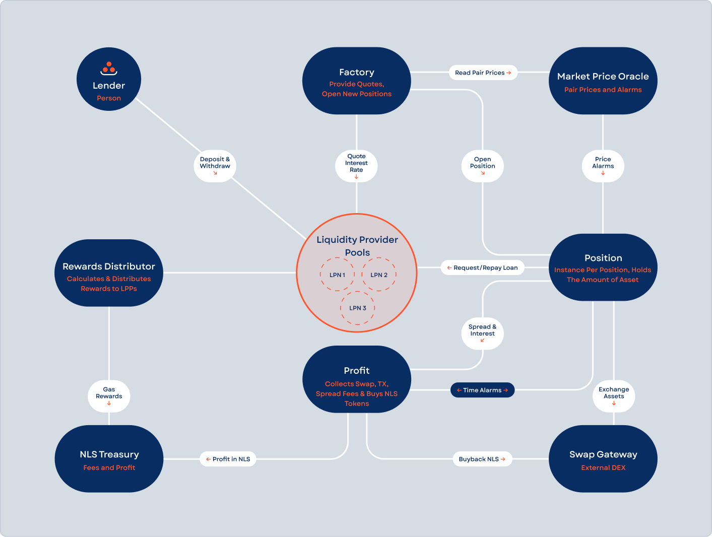

# Lend

_Source: https://hub.nolus.io/en/articles/9680477-lend_

For each supported denomination, there exists a dedicated Liquidity Providers’ Pool (LPP) instance. Each LPP operates with a single Liquidity Pool’s Native (LPN) currency and serves all lenders who deposit liquidity in that currency.

When a user deposits assets into an LPP, they receive a corresponding amount of interest-bearing CW20 tokens, referred to as nLPN (e.g., nUSDC, nATOM). These tokens represent the lender’s share in the pool and accrue interest over time.

Interest is distributed through an index-based accrual mechanism, meaning the value of nLPN increases proportionally as borrowers repay interest into the pool.   
​  
Each nLPN token reflects a fraction of the total pool value, including both the original liquidity and accrued interest from active loans.

When a lender redeems their nLPN tokens, they receive their share of the pool (principal plus accrued interest) based on the current nLPN exchange rate at the time of withdrawal.

[](https://downloads.intercomcdn.com/i/o/hbjifswh/1527049865/675cb6996ea9a247f7238ecf56f6/lend.png?expires=1778235300&signature=d2585037b3ecbcba788147094eaae8a63485d21034e865f80cc7b09766779898&req=dSUlEcl6lIlZXPMW1HO4zereHaB8lhG5HdBCc4h%2BeCX3ktI4mmrylUOuPgbO%0Al7X94aCM0vNTTl7V9KQ%3D%0A)

# **Deposit LPN (Mint nLPN)**

To participate as a lender in an LPP, users must hold the LPP’s native currency (LPN) - for example, USDC - in their wallet. Deposits are made through a transaction carrying an input message, which is processed by the **Cosmos SDK’s [bank module](https://docs.cosmos.network/master/modules/bank/)** to transfer the funds into the LPP smart contract.

Upon deposit, lenders receive a **receipt token** (a CW20 derivative called **nLPN**) representing their share in the pool. These tokens serve both as proof of deposit and a mechanism to withdraw underlying assets at a later time.

The LPP contract initializes each lender’s nLPN balance at zero and tracks a price index representing the current exchange rate between nLPN and LPN. When the pool is empty (e.g., at genesis), the initial exchange rate is set to 1 nLPN = 1 LPN.

Once deposits and borrowing activity begin, the price of nLPN evolves based on:

- Newly deposited LPN tokens
- Interest payments made by borrowers

As time progresses and interest accrues, the value of each nLPN token increases relative to LPN, meaning a lender’s share of the pool grows.

The lender’s current balance (in LPN terms) is calculated as:

```
Lender LPN Balance = Lender nLPN Balance × Price per nLPN
```

The number of nLPN tokens minted for each deposit is determined by the LPP smart contract, using the current price index and tracked using the lender’s wallet address as a key provided with the deposit transaction.

# **Withdraw LPN (Burn nLPN)**

When a withdrawal request is submitted, the LPP smart contract first calculates the amount of LPN the user is entitled to, based on the current nLPN-to-LPN exchange rate:

```
Claimable LPN = Provided nLPN × Price per nLPN
```

Once the claimable amount is computed:

- The user’s nLPN balance is reduced accordingly
- The LPN balance in the LPP smart contract is also updated to reflect the outflow

If the user withdraws their entire balance, the contract automatically includes any accrued interest, effectively closing out their lending position. In this case, they would no longer be considered a participant in the pool as they would have no nLPN.

If the user opts for a partial withdrawal - for example, withdrawing 50% of their position - then only 50% of their nLPN tokens are burned, and their remaining share in the pool continues to accrue interest over time.

# **Additional Incentives**

In addition to interest paid by borrowers, lenders may be eligible for further rewards in NLS, the protocol’s native token. These incentives are distributed to each LPP by the Treasury smart contract and are tracked internally in uNLS, the smallest unit of NLS.

Reward distribution is based on:

- The total value locked (TVL) in a specific LPP
- The aggregate TVL across all LPPs
- TVL threshold brackets, configured via governance in the Treasury contract

Each time the Treasury transfers uNLS to an LPP, a global reward index is updated to reflect the new incentive distribution across all nLPN holders.

ℹ️ Rewards per nLPN, denominated in uNLS, are tracked as part of the global deposit state managed by the LPP smart contract. The actual uNLS balances, however, are maintained by the Cosmos SDK’s bank module.  
​

ℹ️ Each lender is represented by an internal record that includes their wallet address, current nLPN balance, the last recorded reward-per-nLPN value, and any pending uNLS rewards accumulated since their last interaction.  
​

## **Distribute Incentives**

The global reward per nLPN, denominated in uNLS, increases each time the Treasury smart contract transfers new uNLS rewards to the LPP. This value accumulates over time, proportionally raising the value of each nLPN held by lenders.  
​

## **Update and Claim Rewards**

Whenever a lender deposits or withdraws, the contract calculates the rewards accrued up to that point based on the difference between the **global reward per nLPN** and the **lender’s last recorded reward per nLPN**. The resulting value is added to the lender’s pending rewards balance. This update is triggered automatically on deposit, withdrawal, or claim.  
​

When a claim is made, the pending uNLS is transferred to the lender’s address by default, unless another recipient is specified. The lender’s reward index is then synced with the current global reward per nLPN. If the lender withdraws their full LPN balance, any remaining rewards are claimed automatically, and they cease to hold any nLPN tokens.  
​

## **Treasury**

The Treasury is a single-instance smart contract responsible for calculating uNLS rewards across all LPPs based on their individual TVLs and the network-wide aggregate. Each LPP reports its TVL directly to the Treasury, which uses governance-defined threshold intervals to determine the applicable APR. These thresholds start from a minimum value and adjust as higher tiers are reached. Reward distribution is performed periodically, with duration measured in hours.
