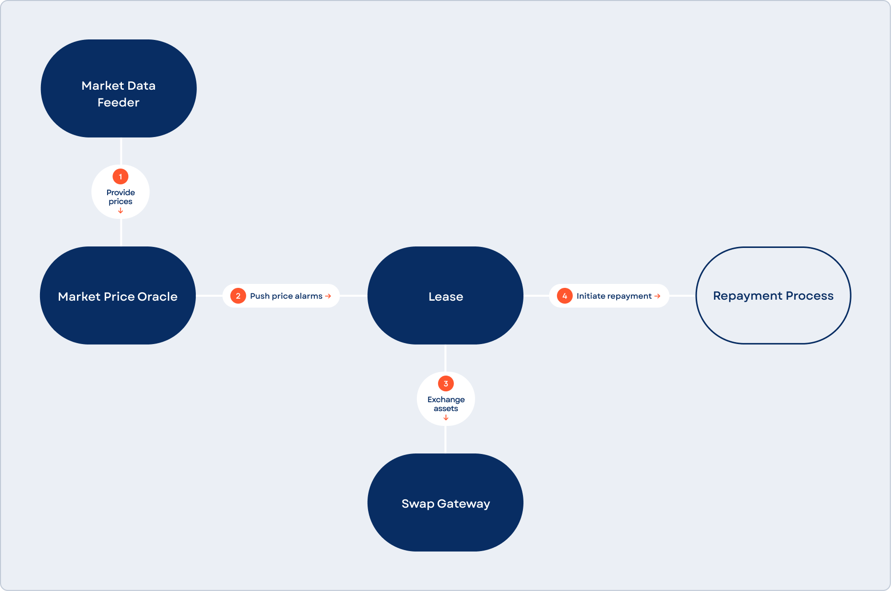

# Liquidations & Risk Framework

_Source: https://hub.nolus.io/en/articles/11378238-liquidations-risk-framework_

## **Liquidations**

If the borrower has open liabilities that do not meet the desired conditions set within the protocol, the system needs to sell (partially or fully) the borrower's collateral so that it remains solvent. These conditions are defined in two invariants:  
​

**1. Interest covered**

If the borrower has an outstanding margin or loan interest left after the defined interest payment period has passed, the invariant is broken, and the repayment algorithm is conducted using the leased amount.

#### **2. Liability covered**

If the current liability of the position is greater than or equal to the max liability, then the invariant is broken, and a market price alarm notification message is sent. Given that the healthy liability is less than the max liability of the Lease, the liquidation amount is either the lease amount itself or the amount that is enough to guarantee a healthy position after the liquidation event has occurred. This liquidation amount is then swapped to LPN and is used as an input to the repayment algorithm. If an excess amount is returned, it is transferred to the Profit contract.  
​

​ℹ️ **Note**: If the lease is fully liquidated, then it is closed.

## Market Anomaly Guard (MAG)

To protect users from unfair liquidations during volatile market conditions, the protocol implements Market Anomaly Guard (MAG)—a price-protective algorithm that evaluates liquidation risk before executing swaps.

### The Challenge

During periods of high volatility, asset prices can temporarily diverge across exchanges and liquidity pools. While arbitrage mechanisms typically correct these discrepancies, a brief window may exist where a DEX displays prices significantly below the market average. This can result in:

- Over-liquidation of user positions
- Unnecessary losses for users
- Potential bad debt for the protocol

#### MAG Implementation

The Market Anomaly Guard operates through the following process:

#### **1. Liquidation Trigger**

When a position crosses the liquidation threshold (determined by an Exponential Moving Average to avoid reacting to momentary price dips), a liquidation attempt is initiated.

#### **2. Minimum Output Validation**

Before executing the swap, the protocol simulates the trade. If the expected output falls below a defined safety threshold relative to the oracle-based EMA price, the liquidation is paused.

#### **3. Dynamic Response**

MAG monitors market conditions during the pause:

- If prices recover and the swap output improves, the liquidation resumes and finalizes
- If the asset price rises back above the liquidation trigger threshold, the liquidation is canceled entirely

This mechanism provides several key benefits:

- Protects users from liquidations at temporarily depressed prices
- Reduces unnecessary liquidation events during volatile market conditions
- Prevents protocol losses from poorly-priced swaps
- Allows positions to recover when market anomalies are temporary

## **Asset-Specific Risk Framework**

To maintain the integrity of the protocol and protect users, Nolus enforces a dynamic risk management framework designed to prevent situations where open margin positions could outstrip the available liquidity necessary for their liquidation. This is especially critical for **long positions**, where declining asset prices often coincide with diminishing stablecoin liquidity in decentralized exchange (DEX) pools, making it less likely that liquidity providers will inject fresh capital.

## **Liquidity and Exposure Limits**

To mitigate this risk, Nolus actively monitors the ratio of active loans to available liquidity in the integrated DEX pools. A core principle of this framework is that no asset should have outstanding loans that exceed a prudent percentage of the pool's available liquidity. While a general benchmark is that active loans should not exceed 20% of the liquidity in a given pool, this threshold is adjusted on a per-asset basis depending on the asset’s broader liquidity profile.

Key factors that influence this assessment include:

- **High Market Capitalization**: A higher market cap typically indicates deeper, more resilient markets.
- **Exchange Diversity**: Assets listed across multiple exchanges benefit from greater liquidity and arbitrage activity.
- **Deep Liquidity**: Widely traded assets require more capital to move the price, reducing manipulation risks.

Thus, an asset with broad exchange coverage and deep global liquidity may be allowed a more relaxed exposure threshold, compared to a niche asset with liquidity concentrated in a single DEX pool.

## **Temporary Delisting Mechanism**

When an asset reaches its predefined risk threshold:

- It is temporarily delisted for opening new long or short positions.
- Existing positions remain fully manageable by users and are not forcibly closed.
- Nolus continues to monitor the asset’s loan-to-liquidity ratio.

If this ratio improves—i.e., loans decrease or liquidity increases—the asset can be reinstated for new margin operations.
