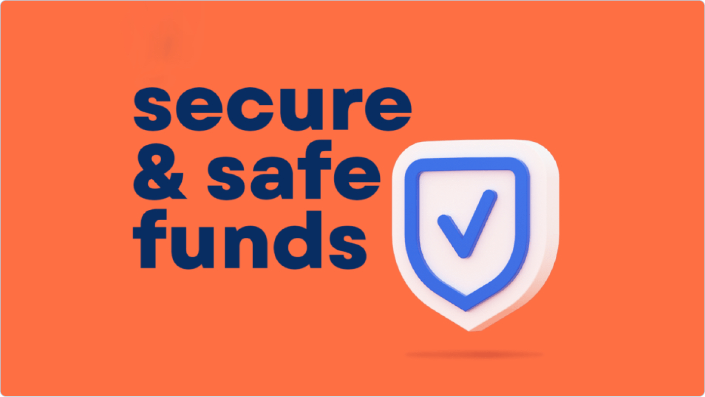

# Security

_Source: https://hub.nolus.io/en/articles/9680739-security_

Nolus Protocol prioritizes security, dedicating substantial resources to ensure reliability and safety. The team maintains transparency by making contracts and balances publicly accessible for verification. To further enhance security, Nolus has undergone comprehensive audits by reputable firms such as Oak Security and Halborn, with reports available for public review.

Additionally, Nolus operates a bug bounty program, encouraging security researchers to identify and report vulnerabilities. Contributors can contact the team at [email protected] to participate in these efforts.

# Audits

|  |  |  |
| --- | --- | --- |
| **Repository** | **Auditor** | **Report** |
| Nolus Core | Oak Security | [View Audit Results](https://github.com/oak-security/audit-reports/blob/master/Nolus/2022-12-12%20Audit%20Report%20-%20Nolus%20Core%20v1.1.pdf) |
| Nolus Money Market | Oak Security | [View Audit Results](https://github.com/oak-security/audit-reports/blob/master/Nolus/2023-01-27%20Audit%20Report%20-%20Nolus%20Money%20Market%20v1.1.pdf) |
| Nolus Money Market | Halborn | [View Audit Results](https://github.com/HalbornSecurity/PublicReports/blob/master/CosmWasm%20Smart%20Contract%20Audits/Nolus_Money_Market_CosmWasm_Smart_Contract_Security_Assessment_Report_Halborn_Final.pdf) |

# Nolus Bug Bounty Program

Nolus’s Core Contributors deeply value the work of ethical hackers dedicated to safeguarding the ecosystem's security and integrity. While Nolus Protocol has undergone thorough audits, undiscovered vulnerabilities may still exist, and we encourage the community to review our contracts and report any issues responsibly.

The Nolus Bounty Program embodies our commitment to community-driven security research. It invites participants to help identify and resolve potential issues across the Nolus blockchain, smart contracts, and web application, with a focus on preventing:

- Theft or freezing of principal funds
- Theft or freezing of unclaimed yields
- Disruptions to website uptime
- Unauthorized access to restricted pages
- Deletion or tampering with user data

To participate, submit a detailed report, written or video, with reproducible steps for the identified vulnerability to [email protected]. Nolus ensures prompt acknowledgment of all submissions and appreciates your contributions to making our platform more secure.
